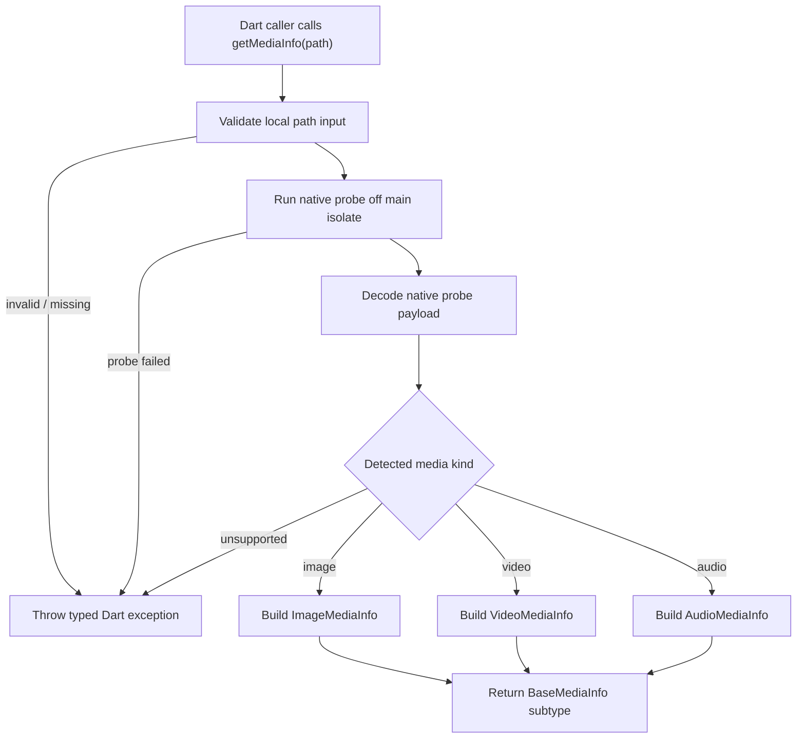

# media-file-info design

## 0. 术语约定

| 术语 | 定义 | 防冲突结论 |
|---|---|---|
| Media file info | 单个本地媒体文件探测后的结构化结果，按图片、视频、音频分 subtype。 | `rg` 未发现已有同名概念；本 feature 使用 `BaseMediaInfo` / `ImageMediaInfo` / `VideoMediaInfo` / `AudioMediaInfo`。 |
| metadata | 容器、流或图片里附带的键值信息。用户提到的 `matedata` 统一按 `metadata` 拼写。 | 代码中暂无已有 metadata 类型；本 feature 新增独立值对象承载。 |
| EXIF | 图片内常见的拍摄设备、方向、时间、地理位置等信息。 | 只作为读取结果暴露，不做写回或编辑。 |
| mime | 用户要求在 subtype 上用受限值表达格式，例如 `ImageMediaInfo.mime = ImageMime.jpg/png/webp`。 | 标准 MIME 字符串另保留为 raw 值；业务分支优先用 subtype 的 `mime` enum。 |
| extension | 文件路径上的扩展名，独立于探测得到的格式。 | 扩展名可用于展示和辅助判断，但不作为唯一可信来源。 |

## 1. 决策与约束

### 需求摘要

做什么：新增完整探测版的单文件媒体信息读取能力，覆盖文件大小、扩展名、MIME/格式、图片宽高、视频宽高/时长/帧率、音频时长/采样率/声道、codec、bitrate、EXIF、metadata。

为谁：Flutter/Dart 调用方，尤其是需要在真正处理媒体前先展示、校验或分流单个本地文件的应用。

成功标准：传入本地图片、视频、音频路径后，返回对应 subtype 的结构化对象；调用方可以通过 `BaseMediaInfo` 接收通用字段，也可以通过具体 subtype 访问专属字段。

明确不做：

- 不扫描目录、不建立媒体库、不处理远程 URL。
- 不转码、不剪辑、不播放、不生成缩略图。
- 不修改或写回 EXIF / metadata。
- 不把多个文件的批处理、队列、缓存纳入第一版。

### 复杂度档位

本 feature 按“对外发布的库”默认档位推进。

- 可观测性 = logged（偏离默认 traced 的原因：这是本地 FFI package，不跨服务；第一版只需要关键失败路径可记录/可诊断）。
- Concurrency = helper-isolate-for-probe（补充维度：媒体探测可能读取容器和流信息，不能阻塞 Flutter 主 isolate）。
- Compatibility = active（偏离默认 stable 的原因：当前包仍是 `0.0.1` 且第一个真实能力，API 可以在初期按 design 调整；实现后再进入稳定约束）。

### 关键决策

1. 数据承载对象使用继承模型。
   `BaseMediaInfo` 只放所有媒体共有的字段；`ImageMediaInfo` / `VideoMediaInfo` / `AudioMediaInfo` 继承它并承载各自字段。这样调用方能写通用处理，也能用类型分支拿到专属字段。

2. subtype 的 `mime` 使用受限 enum，不用裸字符串做业务分支。
   例如 `ImageMediaInfo.mime` 类型为 `ImageMime`，值包含 `jpg`、`png`、`webp` 等；标准 MIME 字符串作为 raw 值保留，避免把 `image/jpeg` 和 `jpg` 这种展示/判断口径混在一起。

3. Dart 层暴露结构化 API，native 层负责完整探测。
   当前项目是 FFI package，已有 `src/` C 源码、`hook/build.dart` native build hook 和 `ffigen.yaml`。完整探测需要 native 层读取容器/流/EXIF 信息，Dart 层负责异步调用、JSON/结构化解码和类型化对象组装。

4. 第一版只读单个本地路径。
   如果未来需要目录扫描、批量队列、缓存、缩略图或写回 metadata，另起 feature；本次验收只看单文件读取。

### 前置依赖

无。实现阶段如果发现完整探测所需 native 依赖无法在当前 build hook 中稳定接入，需要停下来回到 design 调整方案，不在实现里静默降级为轻量版。

## 2. 名词与编排

### 2.1 名词层

#### 现状

- `lib/flutter_media_tools.dart` 暴露模板 API `sum` / `sumAsync`，还没有媒体相关公开类型或函数。
- `src/flutter_media_tools.h` / `src/flutter_media_tools.c` 只声明和实现模板 `sum` 函数。
- `lib/flutter_media_tools_bindings_generated.dart` 由 `ffigen.yaml` 从 C header 生成，目前只包含模板 FFI 绑定。
- `test/flutter_media_tools_test.dart` 只覆盖模板 `sum` 行为。

#### 变化

新增媒体信息值对象，走继承结构：

```dart
// 来源：新增 Dart public API
sealed class BaseMediaInfo {
  final String path;
  final int sizeBytes;
  final String extension;
  final String? rawMimeType;
  final Map<String, String> metadata;
}

final class ImageMediaInfo extends BaseMediaInfo {
  final ImageMime mime;
  final int width;
  final int height;
  final String? codec;
  final int? bitrate;
  final Map<String, String> exif;
}

final class VideoMediaInfo extends BaseMediaInfo {
  final VideoMime mime;
  final int width;
  final int height;
  final Duration duration;
  final double? frameRate;
  final String? codec;
  final int? bitrate;
}

final class AudioMediaInfo extends BaseMediaInfo {
  final AudioMime mime;
  final Duration duration;
  final int? sampleRate;
  final int? channels;
  final String? codec;
  final int? bitrate;
}
```

新增 subtype MIME enum，第一版至少覆盖常见格式：

```dart
// 来源：新增 Dart public API
enum ImageMime { jpg, png, webp, gif, heic, tiff, bmp, unknown }
enum VideoMime { mp4, mov, mkv, webm, avi, unknown }
enum AudioMime { mp3, aac, wav, flac, m4a, ogg, unknown }
```

新增读取入口：

```dart
// 来源：新增 Dart public API
Future<BaseMediaInfo> getMediaInfo(String path);
```

接口示例：

```dart
final BaseMediaInfo info = await getMediaInfo('/tmp/photo.webp');

if (info is ImageMediaInfo) {
  info.mime; // ImageMime.webp
  info.width;
  info.height;
  info.exif;
}
```

主要错误：

- 文件不存在 / 不可读：抛出 `MediaFileNotFoundException` 或同层级 typed exception。
- 文件存在但无法识别为支持的图片、视频、音频：抛出 `UnsupportedMediaFileException`。
- native 探测失败：抛出 `MediaProbeException`，包含可诊断 message，不暴露 native 崩溃细节。

native 与 Dart 的边界新增一条结构化结果通道：native 返回可解码的探测结果和错误信息，Dart 负责转成继承对象。实现可以选择 JSON 字符串或等价结构，但对外 Dart API 不泄漏 native payload。

### 2.2 编排层



#### 现状

当前主流程只有模板 `sumAsync` 的 helper isolate 示例，拓扑是 main isolate 发请求到 helper isolate，helper isolate 调 native 函数后返回 response。媒体探测流程尚不存在。

#### 变化

新增 `getMediaInfo(path)` 编排：

1. Dart 层验证输入是非空本地文件路径。
2. 通过 helper isolate 或等价后台执行路径调用 native probe，避免阻塞 UI isolate。
3. native 层读取文件、容器、流、EXIF/metadata，返回结构化结果。
4. Dart 层根据 media kind 和 subtype MIME enum 组装 `BaseMediaInfo` 子类。
5. 失败路径统一转成 typed Dart exception。

#### 流程级约束

- 错误语义：外部输入错误、文件系统错误、unsupported、native probe failed 必须能区分；调用方不需要解析字符串判断错误类型。
- 幂等性：读取同一路径不修改文件；同一文件内容不变时返回结果应稳定。
- 并发：多个文件可由调用方并发调用，但本 feature 不内置批量队列；内部不能共享会串数据的全局 mutable result buffer。
- 扩展点：新增格式优先扩展 subtype MIME enum 和 native 格式映射，不改 `BaseMediaInfo` 的共有字段语义。
- 可观测点：native probe 失败、payload 解码失败、unsupported format 需要保留诊断 message，便于定位文件或依赖问题。

### 2.3 挂载点清单

- Dart package public API：`lib/flutter_media_tools.dart` — 新增 `getMediaInfo` 入口并导出媒体信息类型。
- Native FFI ABI：`src/flutter_media_tools.h` — 新增 probe/free 相关 C ABI 声明供 ffigen 生成绑定。
- Native build hook：`hook/build.dart` — 接入媒体探测 native 源文件和所需 native 探测依赖。
- Generated bindings contract：`ffigen.yaml` / `lib/flutter_media_tools_bindings_generated.dart` — 重新生成并使用新的 C ABI。

### 2.4 推进策略

1. 编排骨架：建立 `getMediaInfo(path)` 的异步调用和 typed exception 通道，native 节点先返回 stub payload。
   退出信号：Dart 调用能从入口走到 subtype 组装，stub 图片结果可返回 `ImageMediaInfo`。

2. 名词契约：落地 `BaseMediaInfo` 继承体系、subtype MIME enum、metadata / EXIF 承载对象。
   退出信号：Dart 单测能通过 `BaseMediaInfo` 接收，并用 `is ImageMediaInfo` 访问图片字段。

3. native 探测节点：实现单个本地文件的完整 probe，覆盖图片、视频、音频核心字段。
   退出信号：真实测试文件能读出宽高、时长、帧率、采样率、声道、codec、bitrate 中对应字段。

4. metadata / EXIF 映射：把 native 返回的容器 metadata 和图片 EXIF 映射到 Dart 对象。
   退出信号：含 EXIF 的图片返回非空 `exif`；含 metadata 的媒体返回 `metadata`。

5. 错误与边界：补齐不存在、不可读、unsupported、缺字段、probe failed 的错误语义。
   退出信号：每类错误都有 typed exception 或明确空值策略，调用方无需解析 native 原始字符串。

6. 验收覆盖：补齐图片、视频、音频和反向范围守护测试。
   退出信号：第 3 节关键场景均有可观察证据。

### 2.5 结构健康度与微重构

##### 评估

- compound convention：`.codestable/compound` 暂无文档，未命中目录组织 / 文件归属 / 命名约定。
- 文件级 — `lib/flutter_media_tools.dart`：约 108 行，当前是模板 API + helper isolate 示例；本次只应作为 public export/入口挂载，不适合把所有数据类和解析逻辑继续塞进去。
- 文件级 — `src/flutter_media_tools.c` / `src/flutter_media_tools.h`：各约 30 行，当前只有模板函数；媒体探测逻辑属于新职责，直接塞入会让模板函数和真实 probe 混在一起。
- 目录级 — `lib/`：当前只有 public file 和 generated bindings，新增多个媒体类型时若全部平铺在 `lib/` 会污染公开根目录。
- 目录级 — `src/`：当前只有 C 入口文件，新增 probe 源文件数量可控，不触发摊平阈值。

##### 结论：不做微重构

本次不做“只搬不改行为”的微重构。原因：现有文件都很小，当前问题不是旧结构需要搬迁，而是新功能应该落到新文件 / 新目录，避免把真实媒体能力塞进模板示例文件。实现阶段应优先新增 Dart 媒体信息模块和 native probe 源文件，只在既有入口文件做必要挂载。

##### 超出范围的观察

- `lib/flutter_media_tools.dart` 和 `test/flutter_media_tools_test.dart` 仍保留 FFI 模板 `sum` 示例。是否移除模板 API 属于包清理 / breaking API 决策，不作为本 feature 前置条件；建议后续单独走 `cs-refactor` 或新 feature 处理。

## 3. 验收契约

### 关键场景清单

- 输入本地 JPG / PNG / WebP 图片路径 → 返回 `ImageMediaInfo`，包含 `sizeBytes`、`extension`、`mime`、`width`、`height`，`mime` 值分别可为 `ImageMime.jpg/png/webp`。
- 输入含 EXIF 的图片路径 → 返回 `ImageMediaInfo.exif`，至少能观察到若干原文件存在的 EXIF key；缺 EXIF 时返回空 map 而不是报错。
- 输入本地视频路径 → 返回 `VideoMediaInfo`，包含 `width`、`height`、`duration`、`frameRate`、`codec`、`bitrate` 中文件可探测到的字段。
- 输入本地音频路径 → 返回 `AudioMediaInfo`，包含 `duration`、`sampleRate`、`channels`、`codec`、`bitrate` 中文件可探测到的字段。
- 用 `BaseMediaInfo info = await getMediaInfo(path)` 接收任意支持文件 → 通用字段可直接读取，subtype 字段需要通过 `is ImageMediaInfo` / `is VideoMediaInfo` / `is AudioMediaInfo` 分支访问。
- 输入扩展名和实际内容不一致的文件 → 探测结果优先反映真实媒体格式，同时保留原始 `extension`。
- 输入不存在或不可读路径 → 抛出 typed exception，不返回半成品对象。
- 输入非媒体文件 → 抛出 unsupported typed exception。
- native probe 返回缺字段 → 对应 nullable 字段为空或 map 为空，不伪造默认 codec / bitrate / metadata。

### 明确不做的反向核对项

- 代码中不应出现目录递归扫描或批量队列 API。
- 公开 API 不应接受 HTTP/HTTPS URL 作为支持路径。
- 实现不应调用转码、剪辑、播放、缩略图生成或 metadata 写回 API。
- 第一版不应引入缓存层或媒体库索引状态。

## 4. 与项目级架构文档的关系

验收通过后，architecture 需要补充这几类系统级事实：

- 名词：`BaseMediaInfo` 继承体系、subtype MIME enum、metadata / EXIF 承载方式。
- 动词骨架：Dart `getMediaInfo` → helper isolate → native probe → subtype result 的主流程。
- 流程级约束：只读单个本地文件、typed exception、native probe 不阻塞主 isolate、缺字段不伪造。
- 架构入口：`.codestable/architecture/ARCHITECTURE.md` 需要从骨架状态补一段 FFI package 的真实模块索引。
